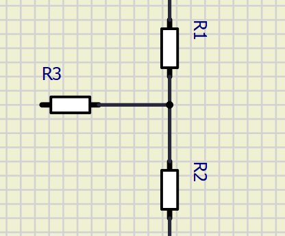

# signal_conditioner
Simple python code to display resistors values that can be used on a signal conditioner circuit.

The above image ilustrates the conditioner circuit.
The code aims to find values for the resistors R1, R2, and R3 ( being R1=R2) that produces a Vout as desired, having received an input Vin
An object created from th Conditioner Class initializes with paremeters:
* desired_output_signal: list, cointains the max and min values of tension desired at the output of the circuit;
* input_signal_rms: list, cointains cointains the max and min values of tension rms at the input of the circuit, aka. the tension we want to modify;
* max_tries: int, the max number of tries (loops) to find best resistors' values matches. The code can find a X numbers of possibilities depending on the number os loops.

